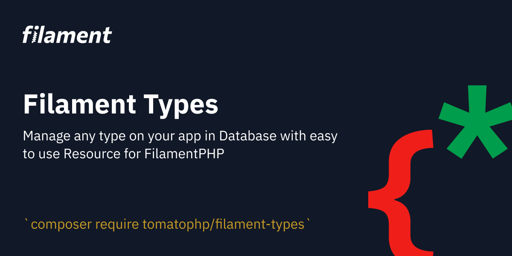
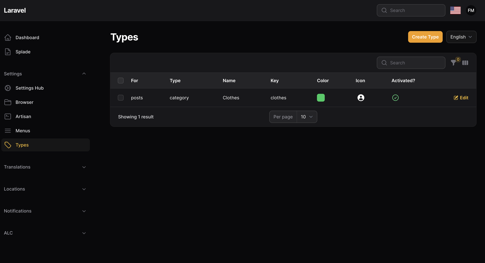
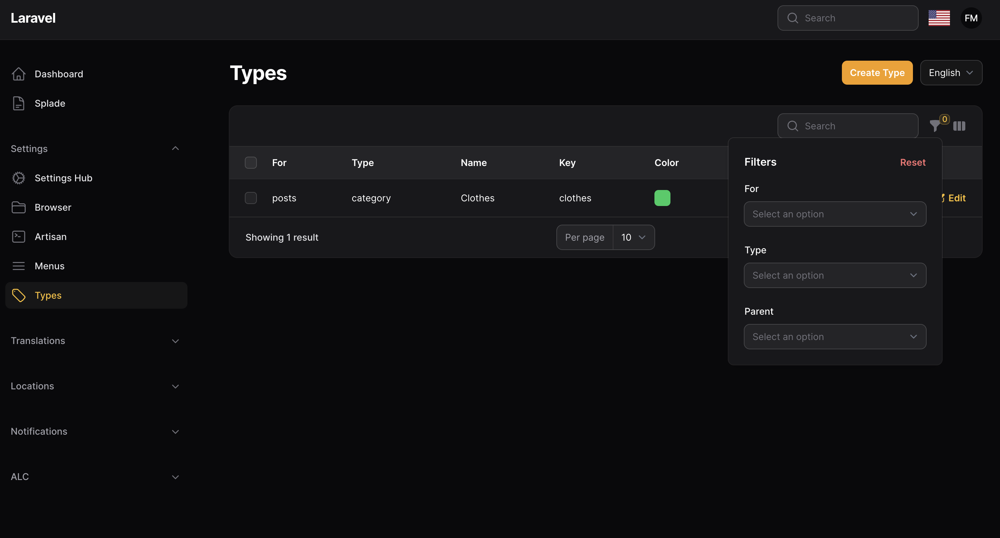
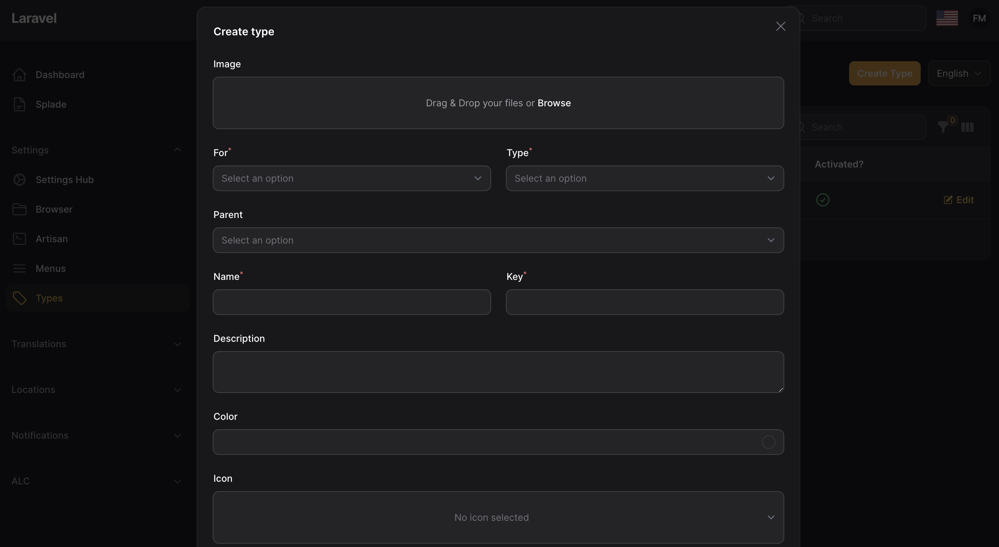

# Filament types

Manage any type on your app in Database with easy to use Resource for FilamentPHP

## Screenshots





## Installation

```bash
composer require tomatophp/filament-types
```
after install your package please run this command

```bash
php artisan filament-types:install
```


finally reigster the plugin on `/app/Providers/Filament/AdminPanelProvider.php`

```php
->plugin(\TomatoPHP\FilamentTypes\FilamentTypesPlugin::make())
```

## Publish Assets

you can publish config file by use this command

```bash
php artisan vendor:publish --tag="filament-types-config"
```

you can publish views file by use this command

```bash
php artisan vendor:publish --tag="filament-types-views"
```

you can publish languages file by use this command

```bash
php artisan vendor:publish --tag="filament-types-lang"
```

you can publish migrations file by use this command

```bash
php artisan vendor:publish --tag="filament-types-migrations"
```

## Support

you can join our discord server to get support [TomatoPHP](https://discord.gg/Xqmt35Uh)

## Docs

you can check docs of this package on [Docs](https://docs.tomatophp.com/plugins/laravel-package-generator)

## Changelog

Please see [CHANGELOG](CHANGELOG.md) for more information on what has changed recently.

## Security

Please see [SECURITY](SECURITY.md) for more information about security.

## Credits

- [Tomatophp](mailto:info@3x1.io)

## License

The MIT License (MIT). Please see [License File](LICENSE.md) for more information.
